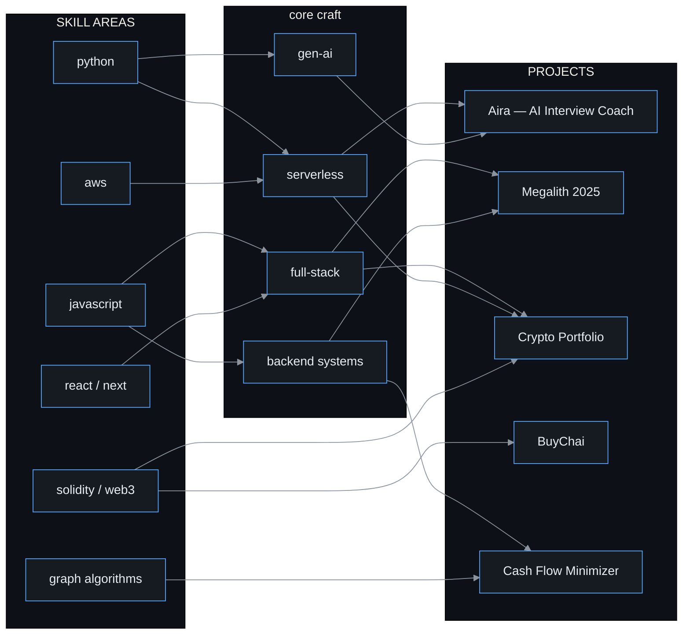
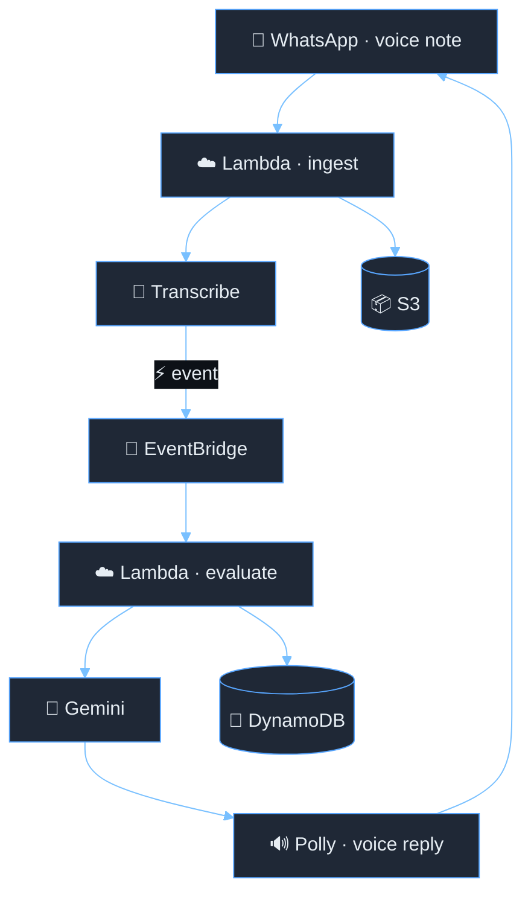

```text
  ╔════════════════════════════════════════════════════════════════╗
  ║          ✦ SHASHANK PANDYA · DEV-OS v4.0 · BOOT SEQUENCE ✦     ║
  ╚════════════════════════════════════════════════════════════════╝

  ⟳ mounting /identity ............. OK   [iit kharagpur]
  ⟳ mounting /skills ............... OK   [47 components]
  ⟳ mounting /projects ............. OK   [5 deployments]
  ⟳ mounting /achievements ......... OK   [12 milestones]
  ⟳ establishing uplink ............ OK   [linkedin · github · portfolio]
  ⛭ system ready.

  full-stack ∿ serverless ∿ ai-assisted
  built on load-paths, coffee, and 20,000+ failed builds
```

<br>

<p align="center">
  
</p>

<h1 align="center">
  <span style="color:#bc8cff">◆</span>&nbsp;
  <span style="color:#e6edf3">SHASHANK</span>&nbsp;
  <span style="color:#f0883e">PANDYA</span>&nbsp;
  <span style="color:#bc8cff">◆</span>
</h1>

<p align="center" style="font-family: monospace; color: #8b949e">
  <b>full-stack developer</b> · <b style='color:#58a6ff'>serverless</b> · <b style='color:#3fb950'>ai-assisted</b> · iit kharagpur
</p>

<p align="center">
  <span style="color:#58a6ff">js</span> ∿
  <span style="color:#f0883e">py</span> ∿
  <span style="color:#3fb950">react</span> ∿
  <span style="color:#bc8cff">node</span> ∿
  <span style="color:#ff7b72">aws</span>
</p>

<p align="center">
  <a href="https://portfolio-shashankpandya.vercel.app/"></a>&nbsp;
  <a href="https://www.linkedin.com/in/shashank-pandya-213366287/"></a>&nbsp;
  <a href="mailto:pandyashashank1@gmail.com"></a>&nbsp;
  <a href="https://github.com/shashankpandya"></a>
</p>

<br>

> **mission statement:** I build software that survives its first user.
> Designed with the eyes of a civil engineer: every system has a load path — if one route fails, another carries the weight.

<details>
<summary><b>⛭ Why a civil engineer became a developer</b></summary>

<br>

I grew up obsessed with bridges — how load propagates through a structure, how redundancy keeps a system standing when one path fails.

Turns out the same instinct applies to software. Load-bearing walls and load-balanced servers are the same sentence in different languages. My civil-engineering training taught me to design for **real-world constraints**; distributed systems taught me to design for **failure**. Both taught me to respect the cost of overbuilding.

</details>

<br>

---

## ⛭ 01 · IDENTITY CARD

<table align="center" width="100%">
  <tr>
    <td width="42%" bgcolor="#0d1117" valign="top">
      <span style="color:#f0883e; font-weight:bold">◈ EDUCATION</span><br><br>
      <span style="color:#e6edf3; font-weight:bold">IIT Kharagpur</span><br>
      <span style="color:#8b949e">B.Tech (Hons.) · Civil Engineering</span><br>
      <span style="color:#8b949e">CGPA: 7.91/10 · Expected 2027</span><br><br>
      <code style="color:#58a6ff">coursework:</code><br>
      <span style="color:#8b949e">Programming & Data Structures</span><br>
      <span style="color:#8b949e">Linear Algebra & Probability</span><br>
      <span style="color:#8b949e">Advanced Calculus · Economics</span>
    </td>
    <td width="28%" bgcolor="#0d1117" valign="top">
      <span style="color:#58a6ff; font-weight:bold">◈ CRAFT</span><br><br>
      <span style="color:#e6edf3">Full-Stack</span><br>
      <span style="color:#e6edf3">Backend Systems</span><br>
      <span style="color:#e6edf3">Serverless / AWS</span><br>
      <span style="color:#e6edf3">Applied Generative AI</span><br><br>
      <code style="color:#f0883e">currently</code><br>
      <span style="color:#8b949e">Reading: DDIA</span><br>
      <span style="color:#8b949e">Learning: System Design</span><br>
      <span style="color:#8b949e">Exploring: Agentic AI</span>
    </td>
    <td width="30%" bgcolor="#0d1117" valign="top">
      <span style="color:#3fb950; font-weight:bold">◈ STATUS</span><br><br>
      <span style="color:#3fb950">● OPEN</span> <span style="color:#8b949e">to full-time roles</span><br><br>
      <span style="color:#f0883e; font-weight:bold">◈ LEADERSHIP</span><br><br>
      <span style="color:#e6edf3; font-weight:bold">Blockchain Head</span><br>
      <span style="color:#8b949e">KodeinKGP · 2025 – present</span><br><br>
      <span style="color:#e6edf3; font-weight:bold">Core Team · Web</span><br>
      <span style="color:#8b949e">Megalith · IIT KGP</span>
    </td>
  </tr>
</table>

<br>

---

## ⛭ 02 · SKILL SECTOR

<table align="center" width="100%">
  <tr>
    <th align="left" bgcolor="#0d1117" width="20%"><span style="color:#f0883e; font-family:monospace">◇ DOMAIN</span></th>
    <th align="left" bgcolor="#0d1117" width="80%"><span style="color:#f0883e; font-family:monospace">◇ SIGNAL STRENGTH</span></th>
  </tr>
  <tr>
    <td align="left" bgcolor="#0d1117"><span style="color:#58a6ff; font-weight:bold">ᴸ Languages</span></td>
    <td align="left" bgcolor="#0d1117" style="font-family:monospace; font-size:0.9em">
      Python&nbsp;&nbsp;&nbsp;&nbsp;&nbsp;<span style="color:#3fb950">████████████</span> 100%<br>
      JavaScript&nbsp;<span style="color:#3fb950">████████████</span> 100%<br>
      TypeScript&nbsp;<span style="color:#3fb950">██████████░░</span> 85%<br>
      C++&nbsp;&nbsp;&nbsp;&nbsp;&nbsp;&nbsp;&nbsp;&nbsp;&nbsp;<span style="color:#3fb950">██████████░░</span> 85%<br>
      C&nbsp;&nbsp;&nbsp;&nbsp;&nbsp;&nbsp;&nbsp;&nbsp;&nbsp;&nbsp;&nbsp;&nbsp;<span style="color:#3fb950">█████████░░░</span> 80%<br>
      SQL&nbsp;&nbsp;&nbsp;&nbsp;&nbsp;&nbsp;&nbsp;&nbsp;&nbsp;<span style="color:#3fb950">████████░░░░</span> 70%<br>
      Solidity&nbsp;&nbsp;&nbsp;&nbsp;<span style="color:#3fb950">███████░░░░░</span> 65%
    </td>
  </tr>
  <tr>
    <td align="left" bgcolor="#0d1117"><span style="color:#f0883e; font-weight:bold">ᶠ Frontend</span></td>
    <td align="left" bgcolor="#0d1117" style="font-family:monospace; font-size:0.9em">
      React&nbsp;&nbsp;&nbsp;&nbsp;&nbsp;&nbsp;<span style="color:#f0883e">████████████</span> 100%<br>
      Next.js&nbsp;&nbsp;&nbsp;&nbsp;&nbsp;<span style="color:#f0883e">██████████░░</span> 85%<br>
      Tailwind&nbsp;&nbsp;&nbsp;&nbsp;<span style="color:#f0883e">██████████░░</span> 85%<br>
      Vite&nbsp;&nbsp;&nbsp;&nbsp;&nbsp;&nbsp;&nbsp;&nbsp;&nbsp;<span style="color:#f0883e">█████████░░░</span> 80%
    </td>
  </tr>
  <tr>
    <td align="left" bgcolor="#0d1117"><span style="color:#bc8cff; font-weight:bold">ᴮ Backend</span></td>
    <td align="left" bgcolor="#0d1117" style="font-family:monospace; font-size:0.9em">
      Node.js&nbsp;&nbsp;&nbsp;&nbsp;&nbsp;<span style="color:#bc8cff">████████████</span> 100%<br>
      Express&nbsp;&nbsp;&nbsp;&nbsp;&nbsp;<span style="color:#bc8cff">██████████░░</span> 85%<br>
      REST APIs&nbsp;&nbsp;&nbsp;<span style="color:#bc8cff">██████████░░</span> 85%
    </td>
  </tr>
  <tr>
    <td align="left" bgcolor="#0d1117"><span style="color:#58a6ff; font-weight:bold">ᴰ Data</span></td>
    <td align="left" bgcolor="#0d1117" style="font-family:monospace; font-size:0.9em">
      MongoDB&nbsp;&nbsp;&nbsp;&nbsp;<span style="color:#58a6ff">██████████░░</span> 85%<br>
      MySQL&nbsp;&nbsp;&nbsp;&nbsp;&nbsp;&nbsp;<span style="color:#58a6ff">████████░░░░</span> 75%<br>
      DynamoDB&nbsp;&nbsp;&nbsp;&nbsp;<span style="color:#58a6ff">███████░░░░░</span> 65%
    </td>
  </tr>
  <tr>
    <td align="left" bgcolor="#0d1117"><span style="color:#ff7b72; font-weight:bold">☁ Cloud / DevOps</span></td>
    <td align="left" bgcolor="#0d1117" style="font-family:monospace; font-size:0.9em">
      AWS Lambda&nbsp;&nbsp;<span style="color:#ff7b72">██████████░░</span> 85%<br>
      EventBridge&nbsp;&nbsp;<span style="color:#ff7b72">████████░░░░</span> 70%<br>
      S3&nbsp;&nbsp;&nbsp;&nbsp;&nbsp;&nbsp;&nbsp;&nbsp;&nbsp;&nbsp;<span style="color:#ff7b72">████████░░░░</span> 70%<br>
      Docker&nbsp;&nbsp;&nbsp;&nbsp;&nbsp;&nbsp;<span style="color:#ff7b72">███████░░░░░</span> 65%<br>
      Git & CI/CD&nbsp;<span style="color:#ff7b72">██████████░░</span> 85%
    </td>
  </tr>
  <tr>
    <td align="left" bgcolor="#0d1117"><span style="color:#3fb950; font-weight:bold">ᴀ AI / Web3</span></td>
    <td align="left" bgcolor="#0d1117" style="font-family:monospace; font-size:0.9em">
      GenAI / LLMs&nbsp;<span style="color:#3fb950">██████████░░</span> 85%<br>
      RAG&nbsp;&nbsp;&nbsp;&nbsp;&nbsp;&nbsp;&nbsp;&nbsp;&nbsp;<span style="color:#3fb950">████████░░░░</span> 70%<br>
      Solidity&nbsp;&nbsp;&nbsp;&nbsp;&nbsp;<span style="color:#3fb950">███████░░░░░</span> 65%<br>
      Ethers.js&nbsp;&nbsp;&nbsp;&nbsp;<span style="color:#3fb950">██████░░░░░░</span> 60%
    </td>
  </tr>
</table>

<br>

---

## ⛭ 03 · ENGINEERING CORE

> "A system is only as strong as its weakest load path."
> — me, still thinking like a civil engineer

```text
  STRUCTURAL ENGINEERING                    SOFTWARE ENGINEERING
  ─────────────────────                    ──────────────────────
  load path            ◄━━━━━━━━━━━━►      request path through services
  redundancy           ◄━━━━━━━━━━━━►      failover · retries · queues
  factor of safety     ◄━━━━━━━━━━━━►      error budgets · observability
  design for worst load◄━━━━━━━━━━━━►      design for real concurrency
  cost of overbuilding ◄━━━━━━━━━━━━►      cost of over-provisioning
```

<table align="center" width="100%">
  <tr>
    <td align="center" width="33%" bgcolor="#0d1117" style="border: 1px solid #58a6ff; border-radius: 8px;">
      <b><span style="color:#58a6ff">◤ DESIGN</span></b><br>
      <span style="color:#8b949e">clear boundaries</span><br>
      <span style="color:#8b949e">honest data models</span><br>
      <span style="color:#8b949e">simple interfaces</span><br>
      <span style="color:#8b949e">accessible UI</span>
    </td>
    <td align="center" width="33%" bgcolor="#0d1117" style="border: 1px solid #3fb950; border-radius: 8px;">
      <b><span style="color:#3fb950">◆ BUILD</span></b><br>
      <span style="color:#8b949e">maintainable structure</span><br>
      <span style="color:#8b949e">predictable errors</span><br>
      <span style="color:#8b949e">secure by default</span><br>
      <span style="color:#8b949e">testable modules</span>
    </td>
    <td align="center" width="33%" bgcolor="#0d1117" style="border: 1px solid #f0883e; border-radius: 8px;">
      <b><span style="color:#f0883e">◢ OPERATE</span></b><br>
      <span style="color:#8b949e">automated deploys</span><br>
      <span style="color:#8b949e">event-driven cloud</span><br>
      <span style="color:#8b949e">cost-conscious infra</span><br>
      <span style="color:#8b949e">visible failures</span>
    </td>
  </tr>
</table>

<br>

---

## ⛭ 04 · UNIVERSE MAP

*A map of everything I've built — and how it connects.*



<br>

---

## ⛭ 05 · MISSION LOG

### ▸ FLAGSHIP — AIRA

<table align="center" width="100%">
  <tr>
    <td bgcolor="#0d1117" width="70%" style="border-left: 4px solid #58a6ff; padding-left: 15px;">
      <span style="color:#f0883e; font-weight:bold; font-size:1.1em;">Aira — Voice-Based AI Interview Coach</span><br>
      <span style="color:#3fb950; font-size:0.9em;">● ACTIVE · serverless</span>
      <br><br>
      <span style="color:#8b949e">
        A technical interview coach that lives entirely inside WhatsApp.
        Users answer in <b>Hindi or Hinglish voice notes</b>; the system
        transcribes, evaluates with Gemini, crafts an adaptive follow-up,
        and speaks the feedback back.
      </span>
      <br><br>
      <code style="color:#58a6ff">architecture →</code>
    </td>
    <td align="center" bgcolor="#0d1117" width="30%">
      <span style="color:#bc8cff; font-weight:bold">IMPACT</span><br><br>
      <span style="color:#3fb950; font-size:1.4em; font-weight:bold">−30%</span><br>
      <span style="color:#8b949e; font-size:0.8em">latency</span><br><br>
      <span style="color:#f0883e; font-size:1.4em; font-weight:bold">100%</span><br>
      <span style="color:#8b949e; font-size:0.8em">asynchronous</span><br><br>
      <span style="color:#58a6ff; font-size:1.4em; font-weight:bold">2×</span><br>
      <span style="color:#8b949e; font-size:0.8em">languages supported</span>
    </td>
  </tr>
</table>



**engineering notes:**
- Decoupled, event-driven — no long-running requests, no user-facing lag
- EventBridge triggers evaluation only after transcription completes
- Ingestion and evaluation scale **independently**
- Session state persisted across turns

**stack:** `Python` · `AWS Lambda` · `Transcribe` · `Polly` · `EventBridge` · `DynamoDB` · `S3` · `Gemini`

[→ repository](https://github.com/shashankpandya/Aira)

---
<br>

### ▸ PROJECT CATALOG

<table align="center" width="100%">
  <tr>
    <th align="left" bgcolor="#0d1117" width="15%"><span style="color:#f0883e; font-family:monospace">◆ MISSION</span></th>
    <th align="left" bgcolor="#0d1117" width="42%"><span style="color:#f0883e; font-family:monospace">◆ OBJECTIVE</span></th>
    <th align="left" bgcolor="#0d1117" width="28%"><span style="color:#f0883e; font-family:monospace">◆ STACK</span></th>
    <th align="center" bgcolor="#0d1117" width="15%"><span style="color:#f0883e; font-family:monospace">◆ STATUS</span></th>
  </tr>
  <tr>
    <td bgcolor="#0d1117"><b style="color:#3fb950">MEGALITH 2025</b><br><span style="color:#8b949e; font-size:0.8em">team project</span></td>
    <td bgcolor="#0d1117"><span style="color:#e6edf3">Official fest portal — registrations, payments, certificates. Processed thousands of users.</span><br><br><span style="color:#8b949e; font-size:0.85em"><b>my contribution:</b> backend APIs · mongoose schemas · admin dashboard · git collaboration</span></td>
    <td bgcolor="#0d1117"><code>Next.js · TS · Tailwind · MongoDB · Razorpay</code></td>
    <td align="center" bgcolor="#0d1117"><span style="color:#3fb950">● LIVE</span></td>
  </tr>
  <tr>
    <td bgcolor="#0d1117"><b style="color:#58a6ff">CRYPTO TRACKER</b><br><span style="color:#8b949e; font-size:0.8em">self project</span></td>
    <td bgcolor="#0d1117"><span style="color:#e6edf3">Privacy-first portfolio tracker — no account, no cloud, data stays in browser. On-chain verification via ERC-20 contracts.</span></td>
    <td bgcolor="#0d1117"><code>React · Vite · Node · IndexedDB · Solidity</code></td>
    <td align="center" bgcolor="#0d1117"><span style="color:#3fb950">● LIVE</span></td>
  </tr>
  <tr>
    <td bgcolor="#0d1117"><b style="color:#bc8cff">BUYCHAI</b><br><span style="color:#8b949e; font-size:0.8em">web3</span></td>
    <td bgcolor="#0d1117"><span style="color:#e6edf3">Decentralised creator support — ETH goes directly to creators via smart contract. Zero platform cut.</span></td>
    <td bgcolor="#0d1117"><code>Solidity · Hardhat · React · Ethers.js</code></td>
    <td align="center" bgcolor="#0d1117"><span style="color:#3fb950">● LIVE</span></td>
  </tr>
  <tr>
    <td bgcolor="#0d1117"><b style="color:#ff7b72">CASH FLOW MIN</b><br><span style="color:#8b949e; font-size:0.8em">graph systems</span></td>
    <td bgcolor="#0d1117"><span style="color:#e6edf3">Banks settle with minimal transactions using graph theory + greedy. <b style='color:#f0883e'>40% fewer edges.</b></span></td>
    <td bgcolor="#0d1117"><code>C++ · STL · Graphs</code></td>
    <td align="center" bgcolor="#0d1117"><span style="color:#8b949e">◌ ARCHIVED</span></td>
  </tr>
</table>

<br>

---

## ⛭ 06 · ACHIEVEMENT SIGNALS

```text
  ▓▓▓▓▓▓▓▓▓▓▓▓▓▓▓▓▓▓▓▓▓▓▓▓▓▓▓▓▓▓▓▓▓▓▓▓▓▓▓▓▓▓▓▓▓▓
  ▓  competitive programming                        ▓
  ▓▓▓▓▓▓▓▓▓▓▓▓▓▓▓▓▓▓▓▓▓▓▓▓▓▓▓▓▓▓▓▓▓▓▓▓▓▓▓▓▓▓▓▓▓▓

  codechef rating    ██████████████████░░░░  1709 · ★★★
  codeforces rating  ███████████████░░░░░░  1390+ · pupil
  codenite 2025      ████████████████████  top 8.8% · 20k+
  starters 191       ████████████████████  top 1.5% · 296/16k

  ▓▓▓▓▓▓▓▓▓▓▓▓▓▓▓▓▓▓▓▓▓▓▓▓▓▓▓▓▓▓▓▓▓▓▓▓▓▓▓▓▓▓▓▓▓▓
  ▓  engineering impact                              ▓
  ▓▓▓▓▓▓▓▓▓▓▓▓▓▓▓▓▓▓▓▓▓▓▓▓▓▓▓▓▓▓▓▓▓▓▓▓▓▓▓▓▓▓▓▓▓▓

  aira latency       ███████████████░░░░░  −30%
  cash flow edges    ████████████████░░░░  −40%
  megalith reach     ████████████████████  thousands of users
  outreach growth    ██████████████████░░  +25% participation
```

<table align="center" width="100%">
  <tr>
    <th align="center" bgcolor="#0d1117" width="25%"><span style="color:#f0883e">🏆 COMPETITIVE</span></th>
    <th align="center" bgcolor="#0d1117" width="25%"><span style="color:#58a6ff">🏅 LEADERSHIP</span></th>
    <th align="center" bgcolor="#0d1117" width="25%"><span style="color:#3fb950">📜 CERTIFICATIONS</span></th>
    <th align="center" bgcolor="#0d1117" width="25%"><span style="color:#bc8cff">🎯 LIFE</span></th>
  </tr>
  <tr>
    <td align="left" bgcolor="#0d1117" valign="top">
      <span style="color:#f0883e">◆</span> <b>CodeChef ★★★</b><br>
      <span style="color:#8b949e">peak 1709 · top 1.5%</span><br><br>
      <span style="color:#f0883e">◆</span> <b>Codeforces Pupil</b><br>
      <span style="color:#8b949e">peak 1390+</span><br><br>
      <span style="color:#f0883e">◆</span> <b>CodeNite 2025</b><br>
      <span style="color:#8b949e">top 8.8% of 20k+</span>
    </td>
    <td align="left" bgcolor="#0d1117" valign="top">
      <span style="color:#58a6ff">◆</span> <b>Blockchain Head</b><br>
      <span style="color:#8b949e">KodeinKGP · mentoring 40+</span><br><br>
      <span style="color:#58a6ff">◆</span> <b>Core Team · Web</b><br>
      <span style="color:#8b949e">Megalith · 4+ drives · +25%</span>
    </td>
    <td align="left" bgcolor="#0d1117" valign="top">
      <span style="color:#3fb950">◆</span> <b>Generative AI</b><br>
      <span style="color:#8b949e">LinkedIn Learning</span><br><br>
      <span style="color:#3fb950">◆</span> <b>Data Science</b><br>
      <span style="color:#8b949e">IBM · Coursera</span><br><br>
      <span style="color:#3fb950">◆</span> <b>SQL Essentials</b><br>
      <span style="color:#8b949e">Newton School</span><br><br>
      <span style="color:#3fb950">◆</span> <b>Web Development</b><br>
      <span style="color:#8b949e">IBM SkillsBuild</span>
    </td>
    <td align="left" bgcolor="#0d1117" valign="top">
      <span style="color:#bc8cff">◆</span> <b>NCC A & B</b><br>
      <span style="color:#8b949e">tent folded in 90s</span><br><br>
      <span style="color:#bc8cff">◆</span> <b>Basketball</b><br>
      <span style="color:#8b949e">Gold · Inter-Hall GC</span><br><br>
      <span style="color:#bc8cff">◆</span> <b>Rangoli</b><br>
      <span style="color:#8b949e">2nd · RP Hall team</span>
    </td>
  </tr>
</table>

<br>

---

## ⛭ 07 · CAREER TRAJECTORY

```text
$ git log --graph --oneline --all --since=2021

* 2025  (HEAD → "the useful year")
*       Aira: serverless AI interview coach → AWS hackathon
*       Blockchain Head @ KodeinKGP · mentoring 40+ devs
*       Cash Flow Minimizer: graph theory · −40% edges
* 2024  Megalith 2025: core team · thousands of registrations
*       Crypto Portfolio: privacy-first · offline-first
*       BuyChai: solidity · web3 · no-intermediary
* 2023  first AWS Lambda → hooked on event-driven
* 2022  codechef ★★★ (1709) · codeforces pupil (1390+)
* 2021  iit kharagpur · b.tech civil · cgpa 7.91
*       first program → parents filed bug report (minor)
```

<br>

---

## ⛭ 08 · TELEMETRY

<p align="center">
  
</p>

<p align="center">
  
  
</p>

<p align="center">
  
</p>

<p align="center">
  <span style="color:#8b949e; font-size:0.85em">⚡ language stats reflect public repos only — the real story is in §05</span>
</p>

<br>

---

## ⛭ 09 · CURRENT OPS

```
  current/building    → serverless + AI-assisted applications on AWS
  current/learning    → distributed systems · system design · observability
  current/reading     → designing data-intensive applications
  current/looking     → full-time software engineering roles
  current/vibe        → "make it work. make it right. make it survive."
```

<br>

---

## ⛭ 10 · TRANSMISSION

<p align="center">
  <b style="color:#e6edf3; font-size:1.1em">Let's build something that survives its first user.</b><br>
  <a href="mailto:pandyashashank1@gmail.com"><span style="color:#EA4335">✉ pandyashashank1@gmail.com</span></a> ·
  <a href="https://www.linkedin.com/in/shashank-pandya-213366287/"><span style="color:#0A66C2">🔗 LinkedIn</span></a> ·
  <a href="https://portfolio-shashankpandya.vercel.app/"><span style="color:#F24E1E">🌐 Portfolio</span></a>
</p>

<p align="center">
  <a href="https://leetcode.com/shashankpandya">LeetCode</a> ∿
  <a href="https://www.codechef.com/users/shashankpandya">CodeChef</a> ∿
  <a href="https://codeforces.com/profile/pandyashashank1">Codeforces</a> ∿
  <a href="https://auth.geeksforgeeks.org/user/shashankpandya/">GfG</a> ∿
  <a href="https://www.hackerrank.com/profile/shashankpandya">HackerRank</a>
</p>

<br>

```text
  ╔══════════════════════════════════════════════════════════════╗
  ║      dev-os uptime: since 2005 · 0 animals harmed             ║
  ║      next update: when the next project ships                 ║
  ╚══════════════════════════════════════════════════════════════╝
```

<p align="center">
  
</p>
